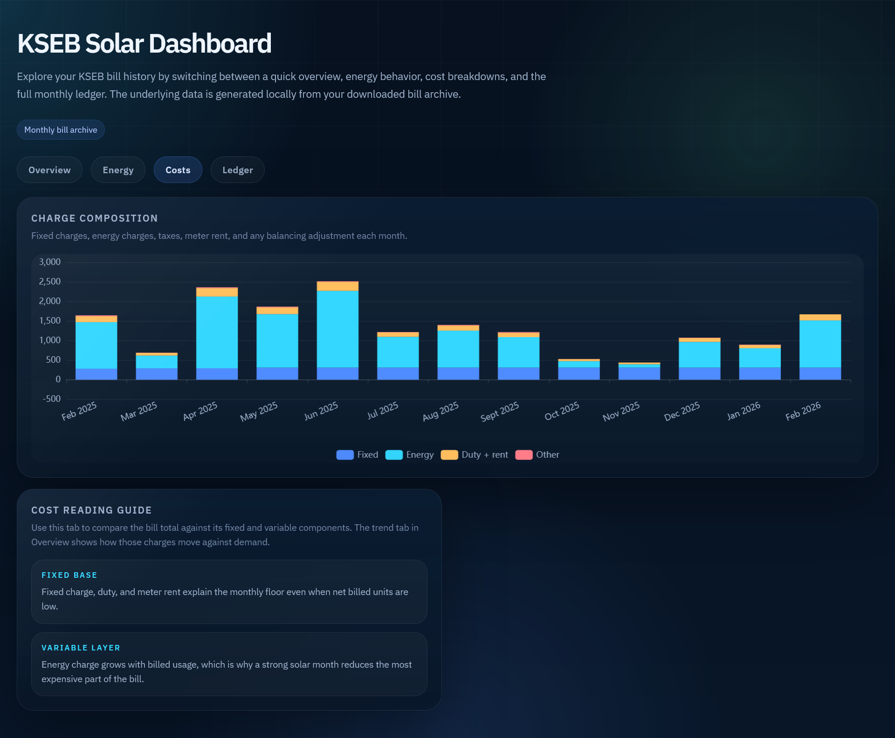

# KSEB Bill Stats

A static dashboard for analyzing KSEB solar bills, backed by a local Python workflow that downloads the latest bill PDF, parses the bill archive, and exports dashboard data files.

## Monthly usage

This project is meant to be run once each month when a new KSEB bill becomes available. Each monthly run downloads the latest bill into your local `kseb-bills/` archive, then refreshes `dashboard/data/bills.json` and `dashboard/data/bills.csv` so the dashboard stays up to date over time.

## Dashboard preview

The current dashboard includes an overview plus dedicated energy, cost, and ledger tabs.


<p>
  
  
  
</p>

## Quick start

1. Create and activate a virtual environment.
2. Install dependencies.
3. Export your local KSEB credentials in the shell.
4. Run the sync command.
5. Serve the folder over HTTP and open the dashboard.

```bash
python3 -m venv .venv
source .venv/bin/activate
pip install -r requirements.txt

# Optional: keep the values in a local .env file, then load it into your shell.
# cp .env.example .env
# set -a && source .env && set +a
export KSEB_CONSUMER_NUMBER="your-consumer-number"
export KSEB_REGISTERED_MOBILE="your-registered-mobile"

python3 scripts/script.py sync --pdf-dir kseb-bills --json dashboard/data/bills.json --csv dashboard/data/bills.csv
python3 -m http.server 8000
```

Then open [http://localhost:8000/dashboard/](http://localhost:8000/dashboard/).

Repeat the sync step once per month to pull in the newest bill and update the dashboard data files.

## Docker usage

The repository also includes a container setup that serves the dashboard and runs the monthly `sync` command automatically inside the container.

1. Copy the example environment file.
2. Fill in your KSEB credentials.
3. Build and start the container.
4. Open the dashboard in your browser.

```bash
cp .env.example .env
# Edit .env and set KSEB_CONSUMER_NUMBER / KSEB_REGISTERED_MOBILE

docker compose up -d --build
```

Then open [http://localhost:8000/dashboard/](http://localhost:8000/dashboard/).

Container behavior:

- Runs `python3 -m http.server 8000` to serve the repository.
- Runs `python3 scripts/script.py sync --pdf-dir kseb-bills --json dashboard/data/bills.json --csv dashboard/data/bills.csv` once on startup by default.
- Schedules the same sync command monthly with cron using `KSEB_SYNC_CRON`.
- Persists downloaded PDFs and generated exports through the compose bind mounts.

Useful Docker commands:

```bash
docker compose logs -f
docker compose exec kseb-dashboard /bin/sh
```

The default monthly schedule is:

```text
0 6 1 * *
```

That means the sync runs at 06:00 on the first day of each month. You can override it in `docker-compose.yml` with any standard cron expression.

## Gitea Actions

The repository includes two Gitea workflows under `.gitea/workflows/` for container automation:

- `docker-build.yml` builds the image on pull requests, manual runs, and pushes to `main`.
- `docker-publish.yml` builds and pushes the `latest` image on manual runs and pushes to `main`.

Set these Gitea Actions secrets before using the publish workflow:

- `DOCKER_REGISTRY_URL`: registry host like `192.168.18.41:3001`
- `DOCKER_REGISTRY_USERNAME`: registry username
- `DOCKER_REGISTRY_PASSWORD`: registry password or access token
- `DOCKER_IMAGE_NAME`: image path like `roadeo/kseb-bill-stats`

The deploy workflow builds `${DOCKER_IMAGE_NAME}:latest`, logs into `${DOCKER_REGISTRY_URL}`, then pushes `${DOCKER_REGISTRY_URL}/${DOCKER_IMAGE_NAME}:latest`.

Published tags:

- `latest` for pushes to `main`

## Safety behavior

- `parse` and `sync` now fail closed: if the PDF folder is missing, empty, or any bill fails validation, the dashboard exports are not overwritten.
- Raw exports are treated as sensitive because they can contain identifiers such as consumer number, bill number, and meter number.
- The CLI refuses to write `--raw-json` output anywhere inside `dashboard/` so sensitive data is not accidentally served over HTTP.

## CLI workflow

Download only:

```bash
python3 scripts/script.py download --pdf-dir kseb-bills
```

Parse the local archive into dashboard outputs:

```bash
python3 scripts/script.py parse --pdf-dir kseb-bills --json dashboard/data/bills.json --csv dashboard/data/bills.csv
```

Run the full local pipeline:

```bash
python3 scripts/script.py sync --pdf-dir kseb-bills --json dashboard/data/bills.json --csv dashboard/data/bills.csv
```

Optional local raw export:

```bash
python3 scripts/script.py parse --pdf-dir kseb-bills --raw-json exports/bills.raw.json
```

The `exports/` example above is intentionally outside the served dashboard path.

If you prefer flags instead of environment variables, `download` and `sync` also accept:

```bash
python3 scripts/script.py sync --consumer-number "..." --registered-mobile "..."
```

## Dashboard data contract

The dashboard reads only `dashboard/data/bills.json`. Each record is expected to follow these rules:

- Required: `record_id`, `bill_date`, and `total_amount`
- Expected date format: `DD-MM-YYYY`
- Numeric fields should be numbers or `null`, not empty strings
- Optional nullable fields include `due_date`, `solar_capacity_kw`, zone-level readings, and solar generation fields
- Raw identifiers such as `consumer_number`, `bill_number`, and `meter_number` are intentionally excluded from the dashboard export

The page derives additional metrics such as home demand, solar self-use, solar coverage, cost per home unit, and balancing adjustments from the clean export.

## Runtime notes

- Serve the repository over HTTP before opening `dashboard/`; opening `index.html` directly will not load `data/bills.json` correctly in most browsers.
- Charts depend on ECharts from a CDN. If the CDN is unavailable, the dashboard still loads the data tables and summary metrics, but chart areas will show a fallback message.

## Project structure

- `dashboard/`: static dashboard app, generated data, and README screenshots
- `dashboard/data/`: generated dashboard-safe JSON and CSV exports used by the static app
- `dashboard/screenshots/`: dashboard preview images used in the README
- `exports/`: recommended local-only location for optional raw JSON exports
- `scripts/`: CLI entrypoint and PDF parsing helpers
- `kseb-bills/`: local archive of downloaded monthly bill PDFs
- `.env.example`: example environment variables that can be sourced into your shell
