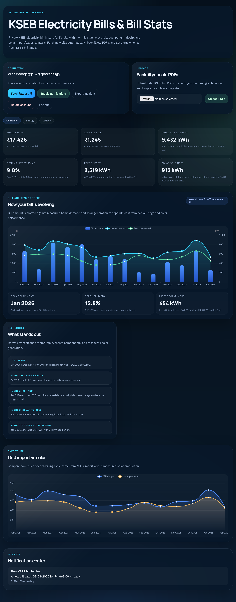
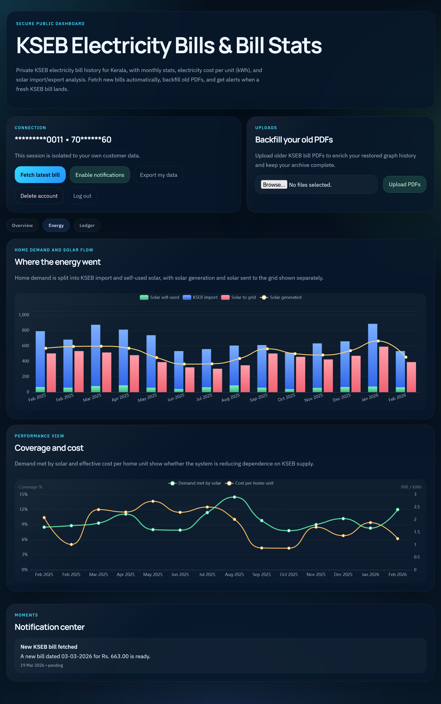
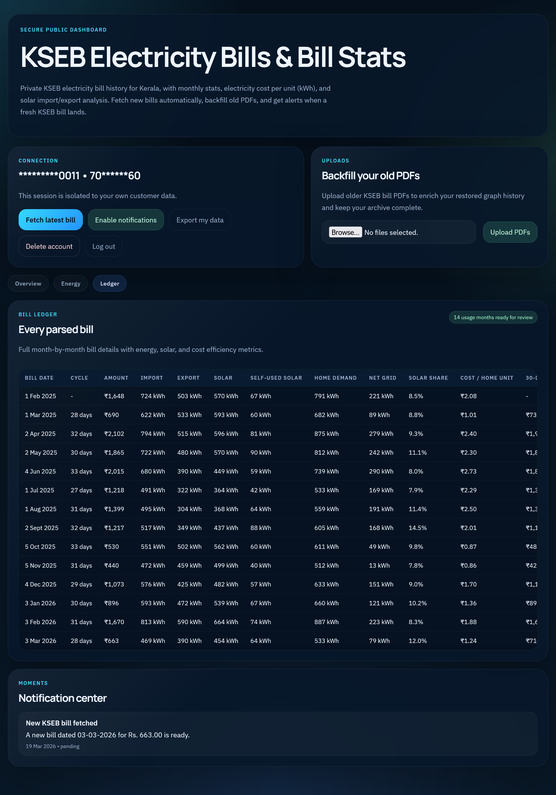

# KSEB Bill Stats

KSEB Bill Stats is a web app for tracking electricity bills with visual analytics, bill history, and PDF-based data ingestion.

## Requirements

- Python 3.11+
- Docker + Docker Compose

## Quick Start

```bash
python3 -m venv .venv
source .venv/bin/activate
pip install -r requirements.txt
cp .env.example .env
docker compose up --build
```

Open [http://localhost:8000](http://localhost:8000).

## Configuration

Set values in `.env` (copied from `.env.example`) before running in non-local environments.

## Screenshots

### Overview



### Energy



### Ledger


