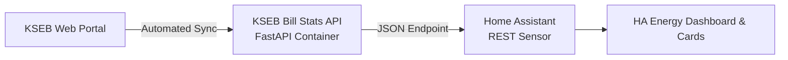

# Home Assistant Integration Guide for KSEB Bill Stats

This guide explains how to integrate **KSEB Bill Stats** into [Home Assistant](https://www.home-assistant.io/) to monitor your Kerala State Electricity Board bills, imported units, rooftop solar generation, and true unit cost (`₹/kWh`) directly in your Home Assistant dashboard and official Energy Dashboard.

---

## Architecture Overview



Since `kseb-bill-stats` already syncs and parses your encrypted bills and metrics, Home Assistant can ingest the latest cycle's numbers using a simple `rest` sensor.

---

## 1. Home Assistant Sensor Configuration

Add the following YAML block to your Home Assistant `configuration.yaml` (or in a dedicated `packages/kseb.yaml`):

```yaml
sensor:
  - platform: rest
    name: "KSEB Electricity Stats"
    resource: "http://<YOUR-KSEB-APP-IP>:8000/api/dashboard"
    method: GET
    headers:
      Content-Type: application/json
    scan_interval: 21600 # Check every 6 hours
    value_template: "{{ value_json.trend[-1].total_amount | default(0) }}"
    unit_of_measurement: "INR"
    json_attributes_path: "$.trend[-1]"
    json_attributes:
      - label
      - bill_date
      - units_imported
      - units_exported
      - solar_generation_kwh
      - solar_self_used_kwh
      - home_demand_kwh
      - solar_coverage
      - cost_per_home_unit
      - net_grid_consumption_kwh

template:
  - sensor:
      - name: "KSEB Latest Bill Spend"
        unique_id: kseb_latest_bill_spend
        state: "{{ state_attr('sensor.kseb_electricity_stats', 'total_amount') | default(0) }}"
        unit_of_measurement: "₹"
        icon: mdi:currency-inr

      - name: "KSEB Units Imported"
        unique_id: kseb_units_imported
        state: "{{ state_attr('sensor.kseb_electricity_stats', 'units_imported') | default(0) }}"
        unit_of_measurement: "kWh"
        device_class: energy
        state_class: total
        icon: mdi:transmission-tower-import

      - name: "KSEB Units Exported"
        unique_id: kseb_units_exported
        state: "{{ state_attr('sensor.kseb_electricity_stats', 'units_exported') | default(0) }}"
        unit_of_measurement: "kWh"
        device_class: energy
        state_class: total
        icon: mdi:transmission-tower-export

      - name: "KSEB True Cost Per Unit"
        unique_id: kseb_cost_per_unit
        state: "{{ state_attr('sensor.kseb_electricity_stats', 'cost_per_home_unit') | default(0) }}"
        unit_of_measurement: "₹/kWh"
        icon: mdi:cash-multiple

      - name: "KSEB Solar Coverage"
        unique_id: kseb_solar_coverage
        state: "{{ state_attr('sensor.kseb_electricity_stats', 'solar_coverage') | default(0) }}"
        unit_of_measurement: "%"
        icon: mdi:solar-power-variant
```

---

## 2. Lovelace Dashboard Card Example

You can add this clean Entities card or Mushroom card to your dashboard:

```yaml
type: entities
title: ⚡ KSEB Energy Tracker
entities:
  - entity: sensor.kseb_latest_bill_spend
    name: Latest Billed Spend
  - entity: sensor.kseb_units_imported
    name: Grid Import (Bi-Monthly)
  - entity: sensor.kseb_units_exported
    name: Solar Export (Bi-Monthly)
  - entity: sensor.kseb_cost_per_unit
    name: True Cost per Unit
  - entity: sensor.kseb_solar_coverage
    name: Solar Self-Sufficiency
```

---

## 3. Automation: Webhook Trigger on New Bill Sync

You can set up a Home Assistant notification when `kseb-bill-stats` detects a newly generated bi-monthly bill from KSEB:

```yaml
alias: "KSEB: New Electricity Bill Notification"
trigger:
  - platform: state
    entity_id: sensor.kseb_latest_bill_spend
condition:
  - condition: template
    value_template: "{{ trigger.from_state.state != trigger.to_state.state }}"
action:
  - service: notify.notify
    data:
      title: "⚡ New KSEB Bill Generated"
      message: >
        Your new KSEB electricity bill is ₹{{ states('sensor.kseb_latest_bill_spend') }}
        for {{ state_attr('sensor.kseb_electricity_stats', 'units_imported') }} imported units.
        True cost: ₹{{ states('sensor.kseb_cost_per_unit') }}/kWh.
```
